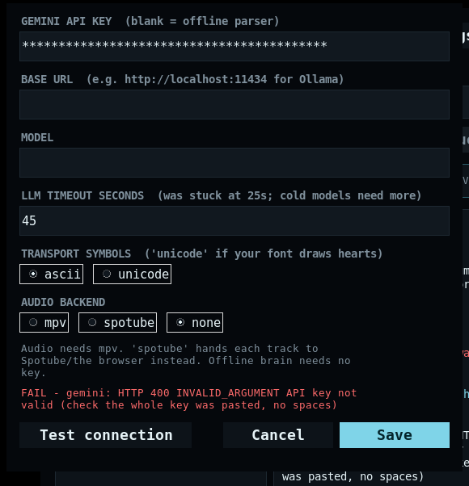

# Spotube DJ

An AI DJ for **Spotify Free**. Say what you want to hear, get a curated,
auto-advancing queue that learns from your skips and likes — with **no Spotify
Premium**, no `403 PREMIUM_REQUIRED`, and no dependency on Spotify's API at all
(it uses it opportunistically if you already have one).

---

## First, the part about integrating `schultz-dev0/SpotifyDJ` into Spotube

I looked at both codebases. Short version: **that integration cannot fix your
problem, and Spotify changed the rules so it can't even be built the way the
README describes.**

**1. SpotifyDJ's entire playback layer is Premium-only.**
`spotify_client.py` drives playback through the Web API: `start_playback()`,
`next_track()`, `previous_track()`, `/v1/me/player/volume`, `/v1/me/player/queue`,
`devices()`. Every `/v1/me/player/*` control endpoint returns

```json
{"error": {"status": 403, "message": "Player command failed: Premium required",
           "reason": "PREMIUM_REQUIRED"}}
```

for free accounts. Its own README admits this ("Spotify Premium (Required for
playback control via API)"). Its "Preference engine" is a `# TODO` in the
to-do list, so there's no local taste model to salvage either.

**2. So integrating it into Spotube buys you nothing.** Spotube's whole reason
for existing is that playback is local and Premium-free (Spotify for metadata,
YouTube for audio). Bolt a tool onto it whose only purpose is remote-controlling
the Spotify player, and you have re-imported the Premium requirement into the
one app that had eliminated it.

**3. And since 11 Feb 2026, the API itself is premium-gated for new apps.**
Spotify's [Developer Access update](https://developer.spotify.com/blog/2026-02-06-update-on-developer-access-and-platform-security)
means Development Mode now requires **the app owner to have Premium**, allows
1 client ID per developer, caps you at 5 authorised users, and restricts you to
a smaller endpoint set. From 9 March those apply to *existing* dev-mode apps too
(they postponed only the endpoint removals). You cannot create a working Spotify
developer app while on Free. Also removed: batch `GET /tracks`,
`/browse/new-releases`, `/browse/categories`, `/artists/{id}/top-tracks`,
`GET /users/{id}`, `/markets`; `track.popularity` and `user.product` are gone;
playlists moved from `tracks` to `items` and only return items for playlists you
own/collaborate on; search limit went 50 → 10 (back to 25 in July 2026).

**The move is the inverse of what you asked for:** don't teach Spotube to
control Spotify. Teach the DJ to play audio like Spotube does. That's this repo.

---

## What this does

```
your words ──> brain ──> your Cloudflare Worker ──> Gemini      (optional; a Worker
                    │      (or Ollama at home, or nothing)       you deploy yourself)
                    │  search queries
                    ▼
             YouTube Music search, music surface only   ← audio + metadata, free
                    │  candidates
                    ▼
             filters.py: is this a song?      ← live event / clip / set = refused
                    │  survivors
                    ▼
             taste model: likes/skips/history ← learned locally, mirrored to D1
                    │  ranked + deduped + interleaved
                    ▼
       mpv (auto-DJ) ──or── m3u8 handed to Spotube ──or── the browser tab
                    │
                    └── the DJ says why: a line on screen, and (via the Worker)
                        a voice over the last seconds of each track
```

- **Zero credentials required.** No Spotify app, no OAuth, no key. Everything
  optional - the planner, the spoken DJ, the cloud copy of your taste - is
  reached through one URL you deploy yourself, so there is no vendor and no
  account between you and the music.
- **Never calls a player endpoint.** There is a test that greps the source for
  `/me/player/play`, `start_playback`, `devices()` etc. and fails the build if
  any appear.
- **Learns from behaviour, not just buttons.** Hear ≥72 % of a track → liked.
  Skip inside the first 28 % → artist penalised. Long skips → mild penalty.
- **Ignores the junk.** Two layers, because one is never enough: search YouTube
  Music's *own* endpoint (it can only answer with music), then put every
  candidate through `filters.py` - 24/7 radios and live broadcasts, film clips,
  6-hour "best of" mixes, karaoke/`Originally Performed By`, AI-generated
  fakes, sample packs, unboxings, `slowed + reverb`, tutorials. Refusals are
  reported with their reason: `--why "your query"`.
- **Refuses live takes.** `Amazing (Live)`, `- Live 1991`, `(MTV Unplugged)`,
  `recorded live in Tokyo` are dropped, not ranked lower. They used to be demoted by
  0.8, which meant they were still played, and "theres LIVE music like performace
  like wtf? is this not been filter?" was a fair question. A song *called* Live is
  still a song, so `Live Forever` and `Live and Let Die` survive (with the demotion
  noted in the log) - the rule fires on a bracketed tag or a phrase that can only
  mean a performance, on the **title** only, so a channel named "Live Nation" cannot
  refuse everything it hosts.
- **De-dupes the same song from two channels** (`Artist - Song` vs
  `Song (Official Video)`) while keeping a genuinely different *recording*
  (acoustic / remix / edit) separate.

## The player: a browser tab

`spotube-dj` with nothing else opens it. One process, one `DJ`, one taste profile -
the UI is a page served on `127.0.0.1:8766` and opened in your browser, and every
verb the terminal has is a button on it.

```bash
spotube-dj                                   # the player, on a port you never think about
spotube-dj --search "tame impala"            # opens already showing results
spotube-dj --web "lofi guitar, slow and warm"     # start the tab mid-request
spotube-dj --web --web-port 8899 --no-browser     # your own port, no tab
spotube-dj --web --web-host 0.0.0.0          # a phone on the same wifi can drive it
```

The current page, with a live queue and real artwork inlined, is
[`web-preview.html`](web-preview.html) in this repo - open it and you are looking at
the same document the server sends.

| Where | What it is |
|---|---|
| **Left - Your Library** | filter chips (`All / Music / Artists / Moods / Loved`), a *Recents ⇄ Name* sort, and the rows this app actually knows: what you heard (history), the artists the profile leans on with their love counts, the moods you asked for, your loved songs. Hover a row for `▶`; its `⋯` menu offers *Mix from this*, *Search for it* and *Forget this artist* - which drops the leaning and never the loved songs. |
| **Top** | Back / forward over the four views, the search box (`What do you want to play?`), and a pill that always says which planner is live - `smart search: failed` in red when a key is saved and the calls are not working. |
| **Middle** | The greeting the hour deserves, quick picks (your own moods and loved songs as tiles), and *Made for you* as a card grid with real artwork. The queue is no longer here - it lives in the right-hand panel now, the way Spotify keeps it, so the middle is just the set being built. | 
| **Right - Now playing + Queue** | The cover, who it is by, *why this song* in the DJ's own words, credits (channel, the search that found it, cached or streamed, the cache line), and *More by this artist* from your likes. Below that is the **Queue**: the up-next rows as compact rows with art, duration and a hover action cluster - `✕ Remove from queue`, `👎 Not for me`, `⋯`. Clicking a row plays it; the row being heard gets animated bars tinted to its cover instead of a number. The blurred, cover-coloured backdrop you see is the same artwork. |
| **Bottom** | shuffle · prev · play/pause · next · repeat (`off → all → one`), a draggable seek bar with times, love, a `⋯` menu (pause/resume, *this is not for me*, unlove, leave the station, stop), Keep mixing, queue, the Spotube handoff, volume with mute, fullscreen. |

Keys: `space` play/pause, `n`/`p` next/previous, `l` love, `s` shuffle, `r` repeat,
`m` mute, `f` fullscreen, `/` the search box, arrows seek 10 s. Nothing needs them,
and typing in a box never steals a shortcut.

Rows behave the way a listener expects, which is more than "double-click works":
the play button slides out of the card on hover, `⋯` offers *Play now / Queue next /
Love this / Start a station*, a loved row plays that song and mixes around it. A queue
row also gets a `✕` and a `👎`: `✕` pulls that one track out of the queue, and `👎`
records a real dislike - `-2.4` on the artist, written into the profile as
`reason: "dislike"` - and removes the row, so the next mix leans away instead of
re-proposing it. Every one of those is one POST to `/api/action`; there is no
client-side state that can drift from the engine.

The playing colour follows the artwork: the equaliser bars, the round play buttons
and the seek bar read the cover's palette, so a warm record glows warm and a blue one
blue. A track change crossfades the blurred backdrop (two layers trade opacity) rather
than cutting between two album colours, which is what made it look like it stuttered.

Album art is fetched for the rows you can see, and a tile of the track's initial on
a per-artist colour is drawn whenever there is no art - so a blocked image host costs
you a picture, not a row.

### Why the Tk window was removed

It worked, and while the engine was being built it was the right call: `tkinter` sits
next to every interpreter, so the window needed no pip install and imported in
**89 ms**. But it could not do the three things that turned out to matter - artwork
behind the content, hover states, and real font/icon control - and each one cost a
fallback of its own: a PNG glyph bank measured at runtime because Tk cannot ask
whether a font owns `⏭`, 480×360 JPEGs decoded to be shown at 64 px, and a `Bridge`
queue whose only job was letting a worker thread touch a widget at all.

So `gui.py` (2 893 lines, measured from the file before it went) is deleted, along with
its Tk-only tests; `--gui` is now an
alias for `--web` that prints one line saying so, and the desktop launcher,
`install.sh` and these docs were changed in the same pass. What stayed is the part
that was never Tk: `viewmodel.py` holds the colours, wording, truncation rules, the
mood table and the greeting boundaries that the page and the CLI both read - the page
inlines them rather than keeping a second copy. The screenshots in `docs/`
(`screenshot*.png`, `gui-brain-error.png`) are kept for the record: they show the skin
that was removed.

If you came here for "why not a native app", the answer did not change shape, only
the toolkit: a browser is the one GUI that is *already installed* on every machine
this runs on, and it is the one that cannot be missing.
## Inside the player: `web.py` and `webapp.py`

The page is not an asset that ships in a folder - `webapp.py` writes the whole
document (CSS, JS, icons, palette) at request time, and `web.py` is the server under
it. That choice buys three things a build step would have cost: there is no npm, no
`node_modules`, nothing to keep patched; the document is one string a test can read;
and a browser is the only GUI guaranteed to exist on the machine, so nothing is
checked at startup any more. The verbs:

```bash
python3 -m spotube_dj --web "lofi guitar, slow and warm"     # opens a tab
python3 -m spotube_dj --web --web-port 8899 --no-browser     # your own port
python3 -m spotube_dj --web --web-host 0.0.0.0               # phone on the same wifi
```

`--web` does **not** start a second DJ. It builds the same `DJ` object
`--daemon` builds and serves its state over `127.0.0.1:8766`; the audio still
comes out of mpv. It also opens the control API on `--port` (default 8765), so the
terminal verbs keep working while you are watching the tab: `spotube-dj next` from
another window moves the same queue you see on screen.

### The front end is four files

`spotube_dj/static/` is the skin, as real files you can open in an editor:

```
static/index.html   the markup, with @@icon@@ tokens where an SVG goes
static/app.css      the stylesheet, with @@COLOUR@@ tokens from viewmodel.py
static/app.js       the tick, the regions, the key map, the verbs
static/icons.json   34 inline SVG paths (no webfont, no CDN, no request)
```

`webapp.py` composes them at request time - substitutes the palette and the
icons, and hands back either **three linked files** (what the server serves) or
**one self-contained document** (`SPOTUBE_DJ_INLINE_PAGE=1`, or `--build-static`
for a host that only takes one file). Both come from the same assets, so they
cannot drift apart. The asset cache keys on `mtime`, so editing `app.css` and
reloading the tab is a real edit cycle - no restart, no build step, no npm.

`web.py` is the socket in front of it:

```
GET  /             the page (index.html + app.css + app.js, same origin)
GET  /app.css      the stylesheet, no-store so an edit shows on reload
GET  /app.js       the script, no-store
GET  /api/state    one snapshot as JSON (2 KB; the page renders from that)
GET  /api/stream   the same snapshot pushed every 0.7s (EventSource)
POST /api/action   next prev pause resume playpause stop topup like unlike auto
                   seek volume request mix radio play_row queue_next love_row open
                   test_brain test_worker worker_sync worker_pull clear_station
                   clear_taste restore_taste                          (27 verbs)
POST /api/search   q= - raw YouTube Music search, for picking a specific song
POST /api/settings key= base= model= clear_key= worker_url= worker_token=
                   worker_profile= worker_sync= clear_worker_token=1, saved to
                   config.json at 0600; the reply carries a mask, never a secret
HEAD /*            the same routes, headers only (a 501 at `curl -I` reads as broken)
PUT DELETE PATCH OPTIONS -> 405 JSON with an Allow header: this app takes GET and
                   POST, it does not do cross-origin writes, and it says so
GET  /art/<name>   the cached artwork, at the size that slot actually draws
GET  /voice/<clip> a spoken DJ line, for a tab with the page open (see below)
```

What you get on screen: a sidebar (Home / Search / Your Library) with mood chips,
the Now Playing tile with its reason line, Up Next with per-row *Play now / Queue
next / Love / Station from this*, the same search-and-refill verbs as the CLI, a
collapsible activity drawer, and a bottom player bar with a click-to-seek track and
volume. Your Library is where the model lives: the artists and moods it learned,
each with a bar for its weight, the loved records, a *Make a mix from this* button
(the same engine call as `spotube-dj mix`), a two-tap *Forget my taste*, and two
settings cards: **Local model & voice** (a Gemini key for a Worker that asks for
one, an Ollama/LM Studio base URL, the model, the DJ's voice and language) and
**Worker & cloud** (see the next chapter) - *Test the planner* and *Test the
worker* run the same probes `--doctor` runs and print the answer in the log.

Two rules the tab follows so that "I pressed something and nothing happened"
cannot come back:

* **no words required.** An empty request box - or the Play button with nothing
  typed, or `spotube-dj mix`, or opening `--web` at all with a profile and no
  request - is one call to `DJ.taste_mix()`. `serve()` starts it on a thread
  before the first paint, so the page you open already has a queue in it.
* **one job at a time, and it says so.** A mix is 4-40 web searches; a second
  press would stack a second job on the same queue. `run_action` refuses it with
  "still building the previous mix - one second", `busy` rides along in every
  state snapshot, and the page dims Play (to "Building"), shows a *building* pill
  and puts "the searches are in the activity log below" where the empty queue was.
  A mood chip plays the mood instead of only searching for it (shift-click still
  searches), and an empty Up Next carries a button that fills it from your likes. The key map is in the chapter above; `draw()` is what the tick
calls, and every region in it decides for itself whether anything changed.

Four decisions in there are the reason the lessons from the window did not have
to be re-learned:

* **the tick is push *and* poll, and neither one can freeze the page.**
  `EventSource` carries one small snapshot per server tick, and the poll stays on
  whatever happens to it: 900 ms while the push is not arriving, 3 s once it is, 4 s
  in a hidden tab. Push alone was the bug - a proxy that buffers a stream leaves the
  page looking fine and stuck on the last song it saw. A failed `fetch` now says
  "the DJ stopped answering" in the header pill rather than throwing the tick away.
  A stalled tab cannot stall the DJ either way: the per-subscriber queue holds two
  frames and drops the rest, which is why one phone with a dead wifi does not freeze
  everyone else's progress bar.
* **one panel cannot take the page down.** Every region in `draw(s)` is called
  through `region(name, fn)`, which catches, names the culprit on the pill once (not
  twice a second), and lets the other thirteen draw. "the UI doesnt change when the
  song changed" was a throw in an early region: the later ones - Now playing, the
  transport - went on holding the previous track while the terminal printed the new
  one. A silent stale panel is the worst failure a player can have, so it is now the
  loudest.
* **artwork is warmed on its own lane, one file per slot.** A state read never
  waits for a download: rows that have a file on disk get an `/art/...` href, rows
  that do not draw a palette tile, and the background fetcher fills the rest. There
  are three sizes because the page has three boxes - 72 px for a list row, 256 px for a
  grid card and 512 px for the hero and the blurred backdrop behind the panel. YouTube
  serves six rungs and only two of them are honest squares: `maxresdefault` (1280x720,
  ~100 KB, clean, often simply absent) and `mqdefault` (320x180, ~11 KB, clean).
  `hqdefault` and `sddefault` were measured on four videos and carried black bars on
  four of four, because the uploader letterboxes them - so `smaller_rung` refuses those
  two for a square slot and `fit_size` starts at `maxresdefault` and falls back to
  `mqdefault`. A *smaller* slot
  may borrow a bigger file, because downscaling is free and looks better; a bigger
  slot never borrows a smaller one. That one rule is the difference between a card
  and a 120x90 frame smeared to 190 px, which is what the grid used to be. Measured
  live on a 12-card page: one picture per row, and the hero's 512 px file is asked for
  only by the record actually being heard. A stored frame is also *resized* to its box
  when Pillow is installed (`_shrink`; ffmpeg stays optional) - measured on a warm page
  that took 28 files and 2 677 KB down to 499 KB, cards from a 95 KB mean to 18 KB, with
  the shorter edge landing exactly on the slot because `object-fit:cover` crops the sides
  of a 16:9 frame. It declines when the source is already smaller than the re-encode, so
  a flat 7 KB 1280x720 frame is stored untouched rather than "optimised" into 9 KB.
* **a like keeps the video id, so the loved list can be dressed.** `taste` stored only
  the words - `title, artist, ts` - which left the sidebar's loved rows with nothing to
  look a cover up by (and nothing to replay). The id travels with the judgement now;
  rows loved before this still show their initial, and loving them again fixes them.
* **a cover has to be the right cover.** The Cover Art Archive is keyed on
  MusicBrainz ids, so every lookup starts with a search, and a search answers
  *almost*: measured, `release-group:"Champion" AND artist:"kanye west"` returns
  `Champions` (a 2016 single) and the page wore a Lollapalooza flyer for a song with no
  sleeve of its own. Three rules keep that from happening, and all three are pinned in
  `tests/test_covers.py`. `_release_group_mbid` accepts a candidate only when its name
  is the same once `_EDITION` strips `(Deluxe Edition)` / `[2010 Remaster]` tails - no
  prefix rule (that re-admits "Champions") and no "best of the type" fallback.
  `_recording_release_mbid` keeps a release only at status `""` or `Official`, because
  a promo sampler answers 200 with a real cover and no `artist-credit` at all. And
  `song_title` removes what a store bolts onto a name (`(feat. Pusha T & Lil Wayne)`,
  `(Album Version)`, `- 2010 Remaster`) before it is searched *and* before it is used as
  the cache key, since MusicBrainz knows the song only as "Runaway" - the suffixed query
  finds nothing. A bracket is required, so "Live and Let Die" keeps its name.
  The result is deliberate: after the gates the archive dressed 2 rows out of 34 looked
  up, down from 7, and every remaining frame is right. Rows nobody claimed keep the
  video's own frame, which is at least *a* picture of the music.
* **the archive never delays a pixel.** One lookup per second is MusicBrainz's stated
  rule, and its shared global search bucket 503s under load, so `covers` runs on its own
  paced thread with the YouTube frame already in the slot: an answered row costs 2 calls,
  a row that needed the title rescue costs 3, and the page paints neither of them. A
  crash in that lane is now written to `last_error()` as `lookup crashed: ...` instead of
  being counted as "no cover" - which is how one missing local variable once left every
  row frameless while `--doctor` reported the feature as on.
* **every box that holds a cover covers it.** `.tile img` had the rule and the hero
  was not a `.tile`, so its `` sat at its natural size in a corner over the
  gradient. `.cover img` now shares the rule (`inset:0`, `object-fit:cover`, above
  the initial), and `tests/test_webapp_page.py` fails if either box loses it.
* **the advance loop belongs to the DJ, not the socket.** `--web` starts
  `DJ.run()` itself when there is a player to watch (so a track ending tops the
  queue and mixes the next one, exactly as `--daemon` does) and starts nothing
  when there is not, because with `--backend none` there is no position to read and
  a frozen Now Playing is a lie. `web.should_run_loop()` is the one-line rule, with
  a test, because "the player works from the terminal but not the window" is a bug
  nobody would find by reading the code.
* **mutations are POST-only, and the Host header is checked.** The port can
  enqueue tracks and move your volume, so a page on `evil.test` must not be able
  to read it via DNS rebinding - `host_ok()` refuses any Host that is not
  loopback, and the CSP (`default-src 'none'`, `style-src`/`script-src`
  `'unsafe-inline'`, `img-src 'self' data:`), `X-Frame-Options: DENY`,
  `nosniff` and `no-store` ride along on every response. Song titles reach the DOM
  as `textContent`, never as markup.

`--web-host 0.0.0.0` is the one place where that boundary is deliberately lowered,
for a phone on the same network: the startup line then says so, and the Host check
switches off (a routable bind means there is no address left to trust). Do not
port-forward it; there is no auth.

### Lists that do not strobe

`/api/state` arrives on the push channel (or the 900 ms poll), and each tick runs one
`draw(s)` over the whole page. That is free only if a region that has not changed is
left alone, so every list goes through one helper:

```js
function redraw(box, sig, make){
  if (!box || box.dataset.sig === sig) return false;
  const top = box.scrollTop;
  box.dataset.sig = sig;
  box.textContent = "";
  make(box);
  box.scrollTop = top;
  return true;
}
```

The signature is the payload the region is about to render (`sigOf(rows)`), so async
artwork landing *is* a change and repaints; the current row's id is part of the queue
grid's signature so the playing marker moves. `setText(node, txt)` does the same for
single labels, which is why the log panes keep their scroll. Two details are answers
to the obvious objections:

* the position line in the credits is the one field that always changes, so it is the
  one element left out of `#credits`' signature and written on its own - the list
  around it is not rebuilt twice a second for a number the progress bar shows anyway;
* the settings inputs are only written when they are not focused (`document.
  activeElement !== node`), because a tick that "helpfully" restores the saved base
  URL makes that field impossible to type in.

Not in the web skin yet, and said plainly so nobody hunts for it: playlist import
(`--sync`, `--playlist` - the tab reads whatever they taught the profile) and
drag-to-reorder. The API key lives in the tab now, because a program that
"learns your taste" and cannot be pointed at a model is only half a feature. Everything the terminal can do,
the page can do, and both can be open at once on the same queue. `--doctor` prints a
`web player` line so you can check the page builds before you file "blank tab" as
a bug. Two environment variables belong to this skin: `SPOTUBE_DJ_NO_BROWSER=1`
(never launch a browser, whatever the flags say — handy in a `.desktop` entry) and
`SPOTUBE_DJ_WEB_HOSTS=dj.local,192.168.1.9` (extra `Host:` names to accept, if you
are behind a reverse proxy and would rather not turn the guard off completely) and
`SPOTUBE_DJ_WEB_DEBUG=1` (print the per-connection tracebacks the server normally
swallows - a tab that stops reading mid-write is a broken pipe on every reload, and
that noise buries the lines worth reading).

Three things here are answers to being poked at rather than to a bug report:

* **the destructive verb asks on the wire.** `clear_taste` needs `sure=1`: the page
  arms on the first tap and sends it on the second, and `curl -d "action=clear_taste"`
  gets back an explanation instead of a wiped profile. The wipe leaves
  `taste-undo.json` behind, and `restore_taste` (the *Bring my taste back* button,
  `spotube-dj taste restore`) puts it back.
* **a nonsense value is a sentence, not a 500.** `pct=NaN` used to escape `int()` as
  a server error; now it answers "'NaN' is not a level - volume stays 60%", clamps
  what it can, and says when it clamped. Same for `auto=maybe`, which used to mean
  "on".
* **a wrong path tells you the map.** Every 404 carries the routes *and* the 28
  action names, so a typo in a script is one read instead of a grep.

And the state file: `state.json` is the one thing in this app a listener is likely to
open and edit, so `artists` as a list, a `null` weight, `volume: "loud"`, or a
half-written file now normalise to something usable instead of an `AttributeError`
before the page opens. Measured on this machine with a live queue of 10: the page is
20 887 bytes plus a 29 KB stylesheet and a 59 KB script, `/api/state` is 8.9 KB in
**1.8 ms** (median of 20), and `tests/test_web.py` is 200 tests. `web-preview.html`
in the repo root is the same page saved as one self-contained file - open it to read
the layout, but its `/art/...` and `/api/...` addresses only resolve while a server
is running, so artwork and playback need `--web`. `python3 -m spotube_dj
--build-static out/` writes the three-file version for a static host.

## Install

```bash
git clone <this repo> spotube-dj && cd spotube-dj
bash install.sh            # venv + yt-dlp + launcher at ~/.local/bin/spotube-dj
spotube-dj --doctor         # what's available, what isn't
```

Manual, if you prefer:

```bash
python3 -m venv .venv && source .venv/bin/activate
pip install -U yt-dlp
sudo apt install mpv ffmpeg            # mpv = playback, ffmpeg = stream merge
PYTHONPATH=$PWD python3 -m spotube_dj --doctor
```

Requires Python 3.10+, stdlib only besides `yt-dlp`. `sudo` appears once above,
for system packages (`mpv`/`ffmpeg`); everything this project writes itself lives
under `~/.spotube-dj` and `~/.local`, and the launcher below asks before adding
an app-menu entry.

## In your app menu (and back out again)

Spotube loads a web app and has no plugin slot, so there is nothing here to
install *into* it. What a free account can have is its own launcher: one icon in
the app menu, one name on the dock, and a gear in the page for the key. `install.sh` offers this at the end; it is also a flag:

```bash
spotube-dj --install-desktop        # ~/.local/share/applications + the icon
spotube-dj --uninstall-desktop      # removes exactly those two files
./uninstall.sh                      # launcher, shim and .venv; keeps your data
```

It writes `~/.local/share/applications/spotube-dj.desktop` (per the freedesktop
spec) plus `~/.local/share/icons/hicolor/256x256/apps/spotube-dj.png`, then runs
`update-desktop-database` / `gtk-update-icon-cache` **only if they exist** - a
desktop without them still gets a working entry, it may just need a logout. No
sudo, nothing in `/usr`, and no attempt to rewrite your dock or favourite apps.
The entry has one extra action (right-click it): *Search for a song*, which opens the
tab already showing that search. The settings live in the page.

`./uninstall.sh` removes the launcher, the icon, the `~/.local/bin/spotube-dj`
shim and `.venv`. It deliberately leaves `~/.spotube-dj/` alone - your history,
taste profile and saved key (that file is mode 600) - and tells you the command
to delete them if you want them gone too.

### If the icon is there but nothing opens

`--install-desktop` checks its own work instead of trusting it, and `--doctor`
repeats the verdict:

```
[ok] desktop launcher launches (self-test)  starts ok (help printed, 80 lines) via .venv/bin/python
```

The self-test reads the `.desktop` file back and verifies the three things that
actually make an entry fail silently: the exec bit, an `Exec=` interpreter that
exists, and *that* interpreter being able to run `-m spotube_dj --help` with the
stripped environment a menu launch gets (a repo moved since install, or a launcher
pointing at system Python while the app lives in `.venv`, both read as "nothing came
up" - now they name themselves). The `Exec=` line is
`<python> -m spotube_dj --web`, so the last step is always "open a tab and print in
the terminal what the tab could not": run that line by hand.

The entry also carries `StartupNotify=true`, which is what stops the icon flashing
while the server starts, and `StartupWMClass=Spotube-dj`. The class no longer has a
window of its own to match - the app's window *is* the browser's - so if a shell
still pairs the launch badly, the notify flag is the half that works.

### If a list repaints while you are looking at it

The page re-reads `/api/state` whether or not you touched it - that is how a like you
made in another tab, or in the terminal, shows up. A list rebuilt on every one of
those reads flickers and throws its scroll position away, so a region only rebuilds
when the payload it is about to render differs from the one it rendered last time, and
a real rebuild puts `scrollTop` back (**0** rebuilds per idle minute of an unchanged
library - the tick arrives, the signature matches, `redraw()` returns false). See
"Lists that do not strobe" above; `RebuildGuardTests` runs those helpers under `node`
against a fake element, so the rule is tested rather than hoped for.

## Use

```bash
spotube-dj "dark synthwave for night driving" --list      # just show the queue
spotube-dj "90s trip hop, dark and slow, female vocals"   # play it, auto-DJ
spotube-dj "chill lofi for studying" --daemon --port 8765 # background + control API
spotube-dj "any mood" --web                                # the browser player instead
```

While a `--daemon` is running, from any other terminal:

```bash
spotube-dj mix       # "play what I like": a set from the profile, no words needed
spotube-dj next      # skip (learns a skip)
spotube-dj prev
spotube-dj like
spotube-dj pause  /  spotube-dj resume
spotube-dj status
spotube-dj retarget "something with more bass"
```

Two more commands for the two things most likely to go wrong:

```bash
spotube-dj --why "lofi beats to relax to"   # every hit + why it was kept or refused
spotube-dj --cache                          # what is on disk, and instant starts
spotube-dj --clear-cache                     # free the space
```

`--daemon` without `--headless` opens mpv. `--backend spotube` hands each track to
Spotube/browser instead of playing it itself. Keyboard media keys work on mpv via
your desktop's MPRIS; with `playerctl` installed you can also bind buttons to
`spotube-dj next`.

### The DJ talks

Two things say what is going on, and only one of them needs any network:

* **the DJ line** - one sentence under the Now Playing tile, built locally from
  what the mixer actually did ("you asked for 'dark synthwave'; it's one of your
  picks; up next: Com Truise"). Always on, no key, nothing invented.
* **the spoken DJ** - that sentence read aloud, and a lead-in over the last ten
  seconds of a track. It needs a Worker (see below): `djvoice.py` asks
  `POST /v1/speech` for the audio. The microphone button in the player bar
  toggles it, `SPOTUBE_DJ_VOICE=off` switches it off for good, and the voice and
  language are chosen in Settings (`Despina` announcing in Indonesian by
  default).

With no tab open the clip is played by mpv; with the page open the tab plays it,
so the audio comes out of the same speakers as the page and the volume keys you
are already using. Either way a voice failure is a note in the log, not a
stopped song.

### Skipping fast, and why a song used to sit at the end

Two things a listener hits on purpose - pressing next twice, and letting a track run
out - used to fail quietly, and both are answers now:

* **the DJ moves on when a song ends, whatever mpv reports.** The loop asked
  `eof-reached` or `time-pos >= duration - 1`, and mpv answers neither: without
  `--keep-open` it unloads the file at the end and *clears the flag it just set*, so
  the poll 750 ms later sees no song, no position and no end. `player.finished()`
  therefore reads three signals - the flag, the length, and "we heard this and now
  the player is idle again" - each needing a `True` rather than a missing value, so a
  busy socket cannot skip a good track. It runs with `--keep-open=yes` as well, which
  is what keeps the last frame and the flag alive. Two backstops: a position frozen
  for 45 s while the player says it is playing is skipped *and logged* ("sat still
  for 45s - moving on"), and an exception in one tick no longer ends the loop - it
  used to kill the thread, which is how "auto advance doesn't work" looked from a
  couch and why nothing said so. A player that *cannot be asked* is the third case, and
  it is now named on the log once per burst (`cannot read the player (TypeError: ...) -
  watching for a stalled position instead`) instead of being mistaken either for the
  end of a song or for silence.
* **the audio lane works on what is about to be heard.** A row queued behind
  fourteen others never wins the race, so an advancing DJ now puts the next two rows at
  the *front* of the lane. And because the lane spawns `yt-dlp` for a row anyway, it
  asks for the stream URL first (`-g`, no bytes) and shares it: a row that is
  *downloadable* but not yet *downloaded* can be started immediately, which is the
  difference between a skip that feels instant and one that waits on a resolver.
  A stashed URL that mpv refuses (signatures expire) is re-resolved once before the
  track is called dead.

## Using it *with* Spotube

Spotube has no queue-injection API, so there's no way to push tracks into a
running Spotube — but it opens `.m3u8` playlists, so this writes one:

```bash
# queue built by the DJ, handed to Spotube as a playlist file
spotube-dj "late night drive" --export --to-spotube

# bake signed direct stream URLs in (for players that can't resolve YouTube)
spotube-dj "late night drive" --export --streams --out ~/Music/dj.m3u8

# rebuild Spotube from one of YOUR playlists (Spotify metadata -> YT audio)
spotube-dj --playlist https://open.spotify.com/playlist/37i9dQZF1... \
           --export --streams --to-spotube

# point Spotube at a SpotifyDJ/Spotify playlist you already made, no API at all:
#   Settings -> Sources -> Spotify, or just search the artist Spotube shows you
```

`--playlist` seeding works off your own playlists (post-Feb-2026 Spotify only
returns items for playlists you own or collaborate on). You can also pass plain
words: `--playlist "bibio, hammock, coley"` seeds the DJ from those artists.

## Teach it your taste without any API

```bash
spotube-dj taste            # what it currently believes you like/avoid
spotube-dj taste --clear
```

If you already have a Spotify dev app from *before* Feb 2026, one extra step
imports your real listening history (metadata endpoints only — never a player
call):

```bash
cp .env.example .env       # SPOTIPY_CLIENT_ID / SPOTIPY_CLIENT_SECRET
spotube-dj sync
```

No app, or a new app on Free? `sync` will fail politely and nothing else
breaks — like/skip inside the DJ builds the profile instead.

## Optional: better query planning

The brain has three modes and the pill in the header says which one you are in
(`smart search: worker` / `smart search: local` / `built-in search`, or
`smart search: failed` in red when an endpoint is configured and the calls are
not working).

```bash
export SPOTUBE_DJ_WORKER_URL=https://spotube-dj.<you>.workers.dev  # Gemini, via your Worker
export SPOTUBE_DJ_WORKER_TOKEN=...                                 # if you deployed one
export SPOTUBE_DJ_BASE_URL=http://localhost:11434                  # Ollama / LM Studio instead
export SPOTUBE_DJ_MODEL=llama3.2:latest
export SPOTUBE_DJ_LLM_TIMEOUT=90                  # slow machine / big model
```

or save them once so they survive a restart:

```bash
python3 -m spotube_dj --set-worker https://spotube-dj.<you>.workers.dev
python3 -m spotube_dj --set-worker-token ... --set-worker-profile laptop
python3 -m spotube_dj --test-worker       # health, then one real plan call
python3 -m spotube_dj --set-base http://localhost:11434 --set-model llama3.2
python3 -m spotube_dj --test-brain        # one real round trip, prints why it failed
```

**A Gemini API key alone is no longer an engine.** This app does not call
`generativelanguage.googleapis.com` from your machine at all - not for plans, not
for the DJ's voice. Gemini is reached through **your** Cloudflare Worker, which
holds the key as a `wrangler secret`. The practical effects: the key is not in a
dotfile on a laptop, not in a shell history, and not in a process list; the model
ladder and the payload-shape negotiation happen once, server-side, instead of
being re-attempted on every machine you install; and the spoken lines and your
taste profile can be shared between machines. A key you save locally is only
ever sent when a Worker explicitly asks for one ("Test the worker" says so), and
then only as an `X-Gemini-Key` header.

If you have no Worker: set `--set-base http://localhost:11434` for Ollama, or
leave both alone and use the offline parser (see below).

Settings go to `~/.spotube-dj/config.json` (`chmod 600`). Environment
variables win over that file. A *blank* field in the Settings dialog means
"clear it", not "keep the default" — clearing the base URL is how you switch
back from a local model to Gemini.

Without any of it the offline parser handles the request — that is the default,
and every live queue result measured in this repo came from it (the screenshots in
`docs/` were taken with an LLM endpoint answering). Either
way the LLM only turns *"philly soul, warm and smooth"* into search strings; it
never gates playback.

### Model names expire; the app now follows the API

`gemini-2.0-flash` was shut down on 2026-06-01 and `gemini-2.5-flash` follows on
**2026-10-16**. A hard-coded default turning into a 404 is exactly how "0%
success" happened here, so the default is `gemini-3.5-flash` and the **Worker**
walks a short ladder (`3.5-flash`, `3.1-flash-lite`, `3.6-flash`, `3.7-flash`).
If the API says *"this model is no longer available, use models/X"*, it retries
with **X** immediately and tells the client which model answered:

```
[brain] worker: gemini-3.5-flash is retired - the API says to use gemini-3.6-flash, trying that
[brain] switched the model to gemini-3.6-flash (saved to config.json)
```

The client does **not** walk the ladder again — the Worker already did, and a
second walk would multiply the calls for no reason. Set `GEMINI_MODEL_LADDER` in
`worker/wrangler.toml` to change the list for every machine at once.

Pick any current id from <https://ai.google.dev/gemini-api/docs/models>. The
request uses the documented `generationConfig.responseFormat` shape (older
`responseMimeType` spelling and a no-config fallback are tried if an endpoint
rejects it), and the key travels in an `x-goog-api-key` header rather than the
URL, so it cannot leak into a log line or shell history.

### When the AI seems dead

Ask it directly instead of guessing — in the page: **gear → Test the planner**
(or *Test the worker*); CLI: `--test-brain` / `--test-worker`, or the `AI brain`
and `cloudflare worker` lines of `--doctor`. Each makes one real request and
prints the actual reason. Every one of these used to look identical
("engine: offline", 0% success):

| What you see | What it means |
|---|---|
| `HTTP 400 ... API key not valid` | key pasted with a space/missing char, or from the wrong console (Gemini reports a dead key as 400, not 401) |
| `HTTP 403 key has no access` | project/region restriction on that key |
| `HTTP 429 quota exceeded` | free tier is used up (per minute *and* per day) — wait, or go local |
| `the API has no such model` / `no longer available` | the *model* id expired - see above; it usually self-heals |
| `nothing listening at http://localhost:11434` | Ollama not running: `ollama serve` |
| `the Worker did not answer` | see the Worker table below: not deployed, wrong token, or a typo in the URL |
| `timed out after 45s` | raise `LLM timeout`, or use a smaller model |
| `response truncated mid-JSON` | the model thought too long; raise timeout / smaller model |
| `could not parse model output` | it answered in prose; check `--test-brain` output text |

It is still *playing* in every one of those rows — the offline parser takes
over and the ACTIVITY panel logs the line starting `[error] LLM not used`, so a
broken key is visible instead of silent.



(the removed Tk skin, kept because it shows the shape of the answer: the failed call
printed where the mix is, not swallowed)

## The Cloudflare Worker

Gemini, the taste profile and the DJ's voice all go through one small Worker you
deploy yourself. It is in this repo, under `worker/`:

```
spotube_dj/webapp.py   ──▶  static/index.html · app.css · app.js   (the skin)
spotube_dj/brain.py    ──▶  POST /v1/plan        (a request -> search queries)
spotube_dj/djvoice.py  ──▶  POST /v1/speech      (a sentence -> audio/wav)
spotube_dj/web.py      ──▶  GET/PUT /v1/state    (your taste profile, in D1)
                            POST/GET /v1/events  (what you liked/skipped, in D1)
```

The app is a pure client of it. Nothing in `spotube_dj/` opens a socket to
`generativelanguage.googleapis.com` any more, and there is no fallback that does
- if the Worker is unreachable the DJ keeps playing with the offline parser and
says so. That is the trade: **one URL to configure instead of a key per machine.**

### Deploy it, once

```bash
cd worker
npm install                                        # just wrangler
npx wrangler login
npx wrangler d1 create spotube-dj                  # paste the id into wrangler.toml
npx wrangler d1 execute spotube-dj --file=schema.sql --remote
npx wrangler r2 bucket create spotube-dj-clips      # optional: caches spoken lines
npx wrangler secret put GEMINI_API_KEY              # free, from Google AI Studio
npx wrangler secret put WORKER_TOKEN                # openssl rand -hex 32
npx wrangler deploy
```

Then point the app at it - in the page (**gear → Worker & cloud → Save the
Worker**) or from the terminal:

```bash
python3 -m spotube_dj --set-worker https://spotube-dj.<you>.workers.dev
python3 -m spotube_dj --set-worker-token "$(openssl rand -hex 32)"
python3 -m spotube_dj --test-worker
```

`--test-worker` calls `/v1/health`, then makes a real plan call, and prints what
it found: which model answered, whether D1 and the clip bucket are bound, and
whether the Worker is holding a key or waiting for yours. `--doctor` gets its
own `cloudflare worker` line for the same reason: "brain: offline" hides four
different faults (no URL, not deployed, wrong token, no D1) that have four
different fixes.

**Deploy `WORKER_TOKEN`.** Without it every route is open to anyone who learns
the URL - including `PUT /v1/state`, which can overwrite your taste profile.
With `GEMINI_API_KEY` absent instead, the Worker relays a key the client sends
(`x-gemini-key`), which is how one paid Worker can serve a friend's install
without handing over the key.

### What your taste does in D1

Every like, dislike and skip is appended to an **event log** and the profile
itself is mirrored as one row per profile name (`WORKER_PROFILE`, default
`default`):

* the local disk stays authoritative - sync is a mirror, never a source of truth
  you have to trust;
* pushes are debounced 20 s and skipped entirely when nothing changed, so a mix
  that touches the profile a dozen times is one write;
* events flush every 15 s, and on startup a machine replays what it missed and
  then **adopts** the cloud profile - but only if its own is empty. A laptop
  that has learned something is never silently overwritten; *Pull my taste* is
  two taps for exactly that reason, and it leaves a backup either way.

Turn it off per machine with `WORKER_SYNC=off` (Settings → Worker & cloud) and
everything stays on that disk.

### The spoken DJ, in the tab

`djvoice.py` asks the Worker for `POST /v1/speech` and gets WAV bytes back; the
Worker wraps raw PCM in a header, and caches each line in R2 keyed on
`sha256(text|voice|model)`, so a line the DJ says twice is synthesized once.

Where it plays depends on whether a tab is listening:

* **the page is open** - the clip is written under `~/.spotube-dj/voice/` and
  the next tick tells the tab to fetch `/voice/<clip>.wav` and play it through
  the page's own `<audio>`. The last 6 clips are kept.
* **no tab (headless `--daemon`)** - mpv plays the file directly, as before.

A sink that queues audio for a browser that is not there would play late or not
at all, and "the DJ went quiet" is the report either way, so the sink declines
and mpv takes over.

The Live API is not used: a Worker cannot open a client WebSocket, so
`*-live-*` model names are mapped onto the REST TTS model server-side and the
switch is reported in an `X-Voice-Notes` header.

### When the Worker seems dead

| What you see | What it means |
|---|---|
| `no Worker URL set` | nothing configured - `--set-worker`, or Settings → Worker |
| `Worker: not deployed / not reachable` | the URL is right and nothing answers: `wrangler deploy`, or a typo in the subdomain |
| `Worker: HTTP 401 (auth)` | `WORKER_TOKEN` mismatch - the token in Settings must be the one you put in the Worker |
| `Worker: this Worker has no D1 database` | `d1 create` + the id in `wrangler.toml` + `--file=schema.sql --remote`. Plans still work; sync does not |
| `Worker: could not find that model` | Google retired the name; the Worker walks the ladder and saves what worked. Raise `GEMINI_MODEL_LADDER` in `wrangler.toml` if it keeps happening |
| `Worker: quota` | the free tier is used up - it is per minute *and* per day. Wait, or go local |
| `Worker: this Worker needs your Gemini key` | no `GEMINI_API_KEY` secret - paste one in Settings (it is sent as a header, and only to this Worker) |
| `Worker: timed out after 45s` | `SPOTUBE_DJ_LLM_TIMEOUT`, or a smaller model |

The full contract - every route, error kind and env var - is in
[`worker/README.md`](worker/README.md). `cd worker && npm test` runs its 22 tests
and `npm run check` does a real `wrangler deploy --dry-run`; neither needs a
network or a Cloudflare account. Run `check` before `deploy`: it is the only
thing that builds the bundle the way Cloudflare will.

## Files

| Path | Role |
|---|---|
| `spotube_dj/brain.py` | request → queries: the Worker, a local OpenAI-compatible endpoint, or the offline parser |
| `spotube_dj/providers.py` | YT-Music search (InnerTube; yt-dlp fallback), stream URLs, Spotify metadata, m3u8 |
| `spotube_dj/filters.py` | what counts as a song: live events, broadcasts, clips, sets, AI fakes - one verdict per candidate |
| `spotube_dj/audiocache.py` | downloads the next tracks ahead of playback - priority lane, LRU by size, and the stream URL it learns on the way is shared with the player |
| `spotube_dj/bins.py` | finds mpv/ffmpeg/yt-dlp when the launch PATH does not contain them |
| `spotube_dj/taste.py` | likes/skips profile, ranking, fingerprint dedupe |
| `spotube_dj/dj.py` | queue, auto-DJ loop, HTTP control server |
| `spotube_dj/player.py` | mpv over IPC, `playerctl`, browser handoff |
| `spotube_dj/__main__.py` | CLI |
| `spotube_dj/web.py` | localhost HTTP/SSE front end over the same `DJ`: routes, actions, artwork warm-up, the voice bus, path and Host guards |
| `spotube_dj/webapp.py` | composes `static/` into the page: palette and icon substitution, one-document or three-file |
| `spotube_dj/static/` | the front end as files: `index.html`, `app.css`, `app.js`, `icons.json` |
| `spotube_dj/workerclient.py` | the only module that talks to the Worker: health, plan, text, speech, state, events |
| `spotube_dj/cloudstate.py` | the D1 mirror: debounced profile push, the event outbox, replay and adopt |
| `spotube_dj/djvoice.py` | the spoken DJ: `POST /v1/speech` from the Worker, played by the tab or by mpv |
| `spotube_dj/viewmodel.py` | every colour, string, key-map and truncation rule the page and the CLI share - no UI code in it, so it is testable |
| `spotube_dj/desktop.py` | the app-menu launcher: write, validate, remove |
| `worker/src/index.js` | the Cloudflare Worker: `/v1/plan`, `/v1/text`, `/v1/speech`, `/v1/state`, `/v1/events` over D1 + R2 |
| `worker/schema.sql` | the two D1 tables: `profiles` and `events` |
| `tests/test_dj_core.py` | 168 tests: queue, taste, search shape, YTM parsing, cache-first start, auto-mix, station seeds, repeat and shuffle, the self-filling queue, the end-of-song rules, the clear verb, the cache race |
| `tests/test_filters_cache.py` | 41 tests: the filter against harvested searches, bins discovery, cache |
| `tests/test_viewmodel_core.py` | 45 tests: the shared tables and rules - greeting boundaries, timings, row shapes, colours, the play lock |
| `tests/test_webapp_page.py` | 48 tests: the tick's per-panel guard, the page's shape, id and verb contracts, the `redraw`/`setText` guards, the cover boxes and their sizes, the CSS a box needs to hold art, and `region()`/`fail()` run under `node`, `node --check`, and that no Tk module comes back |
| `tests/test_brain_config.py` | 57 tests: LLM errors, timeouts, saved config, query hygiene |
| `tests/test_covers.py` | 40 tests: album lookup, rate limiting, the art cache, the per-slot size ladder and its fallback rung, no-ffmpeg behaviour, the status and same-name gates, the queue's lookup tuple |
| `tests/test_desktop.py` | 15 tests: the .desktop file and the icon, in a temp $XDG_DATA_HOME |
| `tests/test_web.py` | 200 tests: the clear-queue verb and its job lane, the published snapshot, every routed action, the transport verbs, library rows, artwork lanes, path traversal, the Host guard, the settings route, one real socket over the routes |
| `tests/test_worker.py` | 53 tests: the Worker client - key custody, error kinds, D1 sync and adopt, the asset split, the voice bus |
| `worker/test/smoke.mjs` | 22 tests: the Worker's routes, token gate, model ladder and WAV wrapping, under `node --test` |

```bash
python3 -m unittest discover -s tests -t .     # from the repo root: 767 tests
cd worker && npm test                          # 22 more, no network
cd worker && npm run check                     # + a real wrangler build (no account)
```

No test touches the network: `tests/__init__.py` points the state dir at a scratch
directory and turns off both the InnerTube search and the audio cache; the Worker
tests build the request object Cloudflare would hand the Worker and read the
response. A test run cannot fire real HTTP, start a real download, or spend a
token.

## Honest limits

- **This rides YouTube Music.** Audio is what YT Music has; instrumentals and
  big catalogue genres are fine, deep regional cuts sometimes aren't. It's also
  outside YouTube's ToS, same as Spotube and every other client of its kind —
  your risk, your IP. Use it to *discover*, then support the artists.
- **Signed stream URLs expire** (a few hours). `--streams` exports are
  short-lived; the `--daemon` path re-resolves every 3 h.
- **Indonesian/regional catalogues**: if a query returns only 1–12 h mixes,
  that's genuinely all YT Music surfaced for those words. Re-word it or name
  artists — `--playlist "name, name"` is the reliable version.
- **When the music endpoint is unavailable** (blocked IP, `SPOTUBE_DJ_YTM=off`),
  the search falls back to plain YouTube and the filter has to judge titles and
  lengths alone. That is a weaker guarantee: `--why` shows what got through, and
  anything the filter could not positively place on the music surface is ranked
  below everything it could.
- **A cached track is a copy on your disk.** Disposable (`--clear-cache`), capped,
  never synced anywhere — but it is ~3 MB per song, so the 512 MB cap is about 150
  tracks. `SPOTUBE_DJ_CACHE_MB` if that is too much for the machine.
- **No official "AI DJ" voice/transition** — Spotify's DJ feature is a
  closed client-side feature, not an API. What you get is the sequencing,
  not Spotify's TTS intro.
- **The spoken DJ is not offline speech.** There is no espeak fallback: the
  voice is Gemini's, reached through your Worker. No Worker (or no tab and no
  mpv) means the DJ writes its line on screen and stays quiet out loud.
- **A Worker URL is now a requirement for Gemini.** There is deliberately no
  direct-to-Google path any more, so an install that used to work with only a
  saved key needs a Worker URL before it plans or speaks again. The offline
  parser keeps working without one.
- **Your taste profile is only as private as your Worker.** Sync is off until
  you set a URL, and the profile itself contains nothing but artists, moods and
  song titles - but it does land in a D1 table you own, under a profile name you
  choose. `WORKER_SYNC=off` keeps it on the disk; deleting the row deletes it.
- **The browser skin is localhost-only by default, and unauthenticated.** That is
  deliberate (`--web` refuses a foreign `Host:`; see the section above), but it also
  means there is no user, no token and no HTTPS: one DJ, one machine, one room. If
  you bind `--web-host 0.0.0.0` for a phone, anyone who can reach that port can
  change your queue and your volume.
- **A mix is only as wide as what you taught it.** `mix` with two loved records
  gives you two artists on repeat, and that is the honest answer, not a bug: the
  engine refuses to invent a station from nothing (`no likes yet` rather than a
  random Top 40). Like a dozen things, or type one mood, and the same button
  becomes a set. `clear` wipes the profile for good - there is no undo, and the
  only second copy is the one you chose to mirror to D1.
- YouTube can rate-limit a datacentre/VPS IP harder than a home connection.
  `--doctor` tells you immediately if that's you.
